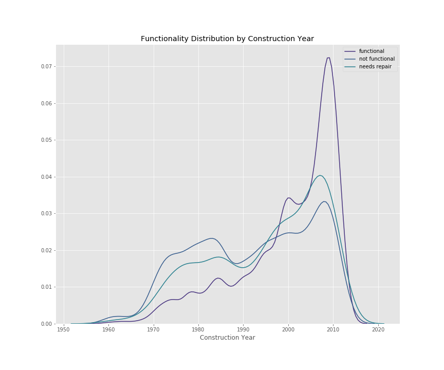
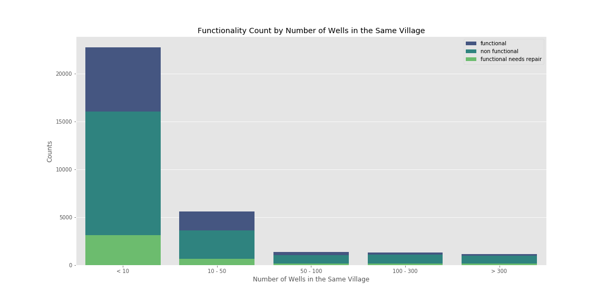

# Tanzanian_water_pump_classificationn
by Eunjoo Byeon and Dolci Sanders

### Classification of Waterpoint Functionality 

This repository contains a process for cleaning and exploring the Taarifa and Tanzanian Ministry of Water data provided as part of a DrivenData.Org competition. Our goal of this project is to predict the functionality of water points around the country in order to improve maintenance operations and increase the accessibility of clean water in Tanzania. 

## The Problem

Only 57% of people in Tanzania have access to water. Since the government launched an initiative to create water accessibility in 2006, the project has been riddled with obstacles (water.org). Even after World Bank stepped in with $1.42 billion in funding in 2007, the theorecal plans have not fared well in the real world (Chloe Farand for the Independent). 

Tanzania National Website states that water-borne illesses like cholera and malaria account for over half of the disease in the country. 

Tanzania has often been thought of as a developing country, but it has major potential for aggricultural growth, such as coffee and avocados, that would lead to economic growth in the country where there is an absence of a middle class and wide spread poverty. But agriculture depends on year round water supplies. Water accessibility is critical to the growth of not only the country, but also civil rights by extension. The gathering of water generally falls on the women in the communities and by extension their children, particuarly the girls. These families travel kilometers away for each bucket of water often pulling their girls out of school to help transport this essential resource. 

While Tanzania now has many water points, 60,400 to be exact, the battle is far from over as 22,824 are non functional and another 4,317 are partially functional and in need of repairs. 

## File Structure

#### 010_Cleaning.ipynb 
	- Quickly cleans data and fills in null values. 

#### 020_EDA.ipynb 
	- Assesses, compares, selects features relevant to the data with visualizations.
	- Engineers new features relating to location. 

#### 030_Model_Evaluation.ipynb  
	- Outlines model testing 
	- Overall scoring metric balanced accuracy
	- F1 weighted score as less emphasis is needed on false positives or negatives
	- Recall of Functional Needs Repairs allowed us to monitor the correct positive predictions of the minority class

#### 040_Final_Testing.ipynb
	- Final models and results

#### 050_Visual_Analysis.ipynb
	- Overview of the visual analysis of the data. 

## Data Cleaning

We started with 59400 observations. We cleaned the data by checking duplicates, Nan, and Null  values. The ways they were filled depended on each individual feature, what we knew about the feature, and sometimes the frequency of the input. 

Due to the input being extremely messy for both installers and funcers we untilized vectorization to fix these typo issues before condensing the feature into those with frequencies of over 100 and others. 

35% of the construction years and GPS height were missing values, but because they are important factors, kept the features with input of 0 for unknown years. 

## Exploratory Data Analysis

After cleaning up the missing values and typos, we proceeded to the data analysis. 

 

## Target 

Starting with our target class which was heavily class imbalanced as seen above. We will be predicting a multi-class problem, so making sure the model is not biased in our models now will save a lot of time an money in the real world and more accurately help us predict the minority. 

Once we the target was assessed, the proceeded to analyzing our features as with 39 original columns, we needed to make sure there weren't features that were too similar, cutting down on uncessesary ones also helped to make our models when taken into the computational load. For many colums the data was very similar with different breakdown methods. After comparing at heatmaps between them, we were better able to decide which features were most informative for the prediction.

#### Continuous Variables
	- ['amount_tsh']
	- ['gps_height']
	- ['longitude']
	- ['latitude']
	- ['population']
	- ['construction_year']

Construction Year separated into decades between 50s and 2020s to allow for easier visualizations of what decade the waterpoint was built in. Due to many null values, the unknowns were marked with 'others'. 

Construction Year shows us the distribution over time. We can see that while functional waterpoints increased between the 70s and 2010s, the waterpoints that need repairs or are non functional have also steadily risen. 

#### Categorical Variables

Location features: 

['basin']
['region']
['district_code']
['lga'] 
['ward']
['subvillage']

The location data provided led us to engineer features that included distances to basins and local government authorities. We also paired down some location data such as wards and subvillages to try to filter out some noise when predicting our target.

 Geo Pandas Mapping

While looking though the data we were able to use visualizations to help support and guide our findings. This is a map of water points by condition in Tazania. We can see that some clustering of functionality is visible. As location information seemed important, we expanded upon the current features by engineering with distance and location predictors such as distance to the basin and local government area center. 

Given these features are related, we paired with latitiude and longitude coordinates to engineer additional features such as: 

       ['n_wells_village'] - number of wells in each village
       ['basin_lat'] - coordinates of the basins
       ['basin_long'] - coordinates of the basins
       ['dist_to_basin'] - distance to basin
       ['lga_lat'] - coordinates of the local government areas
       ['lga_long'] - coordinates of the local government areas
       ['dist_to_lga'] - distance to the local government areas 

The data shows that the majority of villages have less than 10 accessible water pumps and nearly half of those waterpoints are non functional.    

Payment type seems to be a direct predictor of the maintenance of these water points as we can expect. Steadier payment plan is, it is likely to be functioning. This brings a question of how funding for Tanzania water project is actually being utilized. 

['funder'] - who funded the project
['installer'] - who installed the project
['quantity'] - the output level of the waterpoint
[ 'water_quality'] - quality of water
['payment_type'] - how payment is made (per bucket, monthly, yearly)
['source'] - water source
['waterpoint_type'] - how the water is pumped by then end user
['extraction_type'] - type of mechanism the water is pumped with

['management'] - team responsible for the maintanence 
['public_meeting'] - "true/false" was all the explaination given
['permit'] - if the waterpoint has a permit
['scheme_management'] - operator of the waterpoint
['num_private'] - no data given

Most pumps utilize gravity pump or old fashioned hand pump. We can see that electric water pumps like motor pump and submersible pump are not well maintained and more likely to fail. The few wind-powered extraction types seemed to be not working as well. 

Model Evaluations 

Final Model  

Conclusion

By being able to predict which wells need repair, this would significantly cut down on resources being spent on waterpoint checks where they are less needed and concentrate the focus to the problem areas giving way to quicker improvements and by extension additional availability of this critical resource (Driven Data, Taarifa, Tanzania Ministry of Water).

