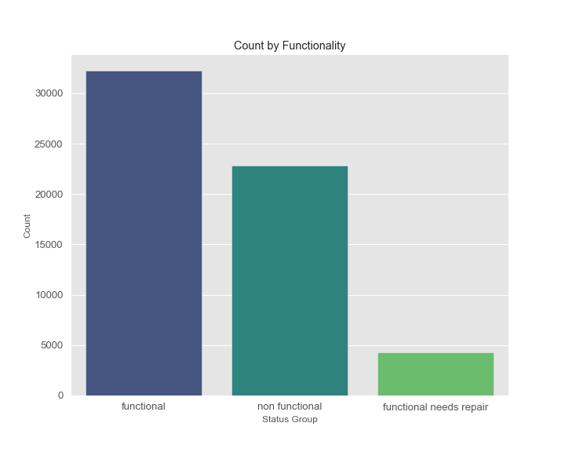
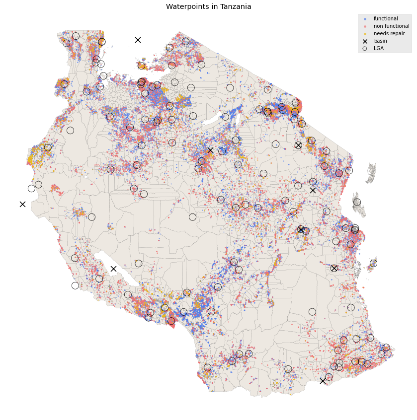
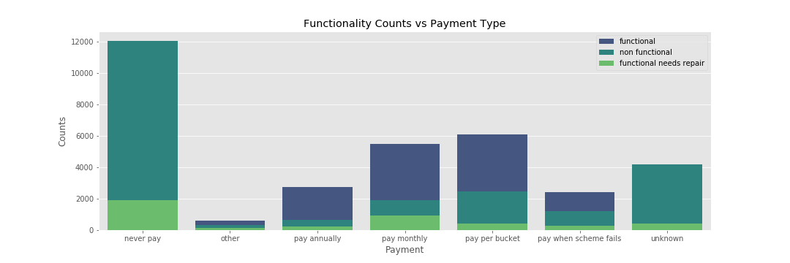
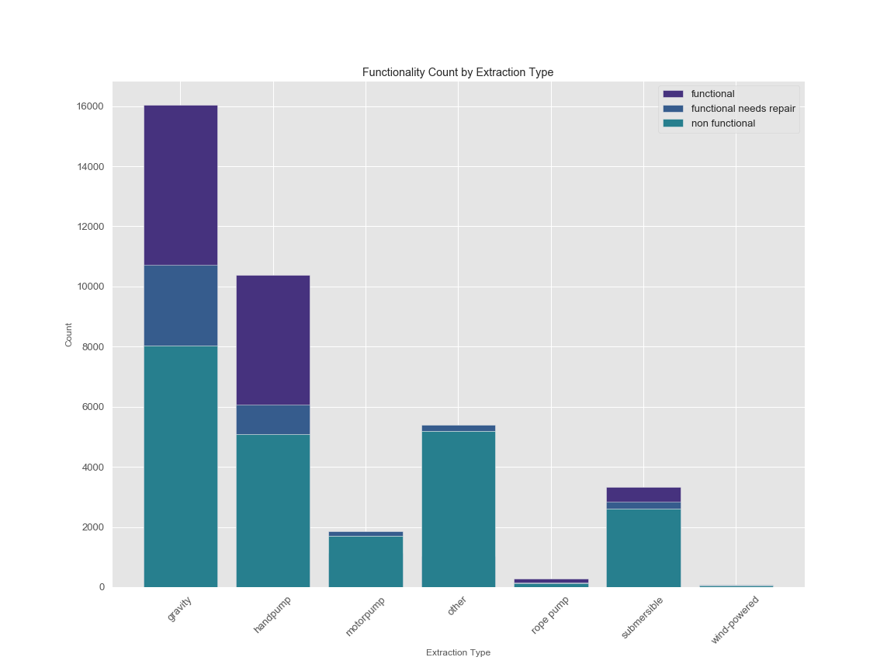

# Tanzanian Water Points Prediction
by Eunjoo Byeon and Dolci Sanders

### Multi-Class Prediction of Water Points Functionality 

This repository contains a process for running multi-class prediction on the water points condition in Tanzania. Our goal of this project is to predict the functionality of water points around the country in order to improve maintenance operations and increase the accessibility of clean water in Tanzania. 

## Data
Data is from the Taarifa and Tanzanian Ministry of Water data provided as part of a DrivenData.Org competition.

## The Problem

Only 57% of people in Tanzania have access to safe water. Since the government launched an initiative to create water accessibility in 2006, the project has been riddled with obstacles (water.org). Even after World Bank stepped in with $1.42 billion in funding in 2007, the theorecal plans have not fared well in the real world (Chloe Farand for the Independent). 

Tanzania National website states that water-borne illesses like cholera and malaria account for over half of the disease in the country.  

Tanzania has often been thought of as a developing country, but it has major potential for aggricultural growth, such as coffee and avocados, that would lead to economic growth in the country where there is an absence of a middle class and wide spread poverty. But agriculture depends on year round water supplies. Water accessibility is critical to the growth of not only the country, but also civil rights by extension. The gathering of water generally falls on the women in the communities and by extension their children, particuarly the girls. These families travel kilometers away for each bucket of water often pulling their girls out of school to help transport this essential resource.  

While Tanzania now has many water points, 60,400 to be exact, the battle is far from over as 22,824 are non functional and another 4,317 are partially functional and in need of repairs (information only based on our current dataset).  

## File Structure

#### 010.Data_Cleaning.ipynb 
- Structural cleaning of data such as dealing with missing values. 

#### 020.Exploratory_Data_Analysis.ipynb 
- Assesses, compares, selects features relevant to the data with visualizations.
- Engineers new features relating to location. 

#### 030.Model_Evaluation_Clean.ipynb  
- Outlines the process of model testing and evaluation

#### 040_Final_Testing.ipynb
- Final model performance on test set

## Data Cleaning

We started with 59,400 observations. We cleaned the data by checking duplicates and missing values. Missing values were imputed based on what we knew about the feature, and sometimes the frequency of the input. 

Due to the input being extremely messy for both installers and funders, we untilized vectorization to fix these typo issues before condensing the feature into those with frequencies of over 100 and others. 

Large amount of the construction years and GPS height were missing, but because they were important predictors, we implemented categorization to keep these features.

## Exploratory Data Analysis

 

## Target: Water Point Status Group 

Our target variable consists of three classes that are heavily imbalanced as seen above.  

## Predictors 
Here we outline a few predictors that were included in our model.  

### Construction Year

Construction year had a significant implication to our data but many were missing. So we created sub-bins and treated this variable as categorical. The initial EDA showed that most of functional water points were built recently. At the same time, there were also significant number of recently built water points that were already not functional.

### Locations

 Geo Pandas Mapping

This is a map of water points by condition in Tazania. We can see that some clustering of functionality is visible. As location information seemed important, we expanded upon the current features by engineering with distance and location predictors such as distance to the basin and local government area center. 

### Payment 

Payment type seems to be a direct predictor of the maintenance of these water points as we can expect. Steadier payment plan is, it is likely to be functioning. This brings a question of how funding for Tanzania water project is actually being utilized. 

### Extraction Type

Most pumps utilize gravity pump or old fashioned hand pump. We can see that electric water pumps like motor pump and submersible pump are not well maintained and more likely to fail. The few wind-powered extraction types seemed to be not working as well. 

### Other Predictors included ...
amount_tsh - total static head  
funder - who funded the project  
installer - who installed the project  
quantity - the output level of the waterpoint  
water_quality - quality of water  
payment_type - how payment is made (per bucket, monthly, yearly)  
source - water source  
waterpoint_type - how the water is pumped by then end user  
management - team responsible for the maintanence  
public_meeting - "true/false" was all the explaination given  
permit - if the waterpoint has a permit  
scheme_managemen - operator of the waterpoint  
num_private 

## Model Evaluation

### Evaluation Metrics
Our target is multi-class with imbalance issue where we have a very few observations of water points that needs repair compared to the ones that are functioning. It was important to us to not miss the non functioning or need for repair cases, as it is directly related to the lives of people using that water points. 

So for our model evaluation, we prioritized the **balanced accuracy score**. This computes the average accuracy score weighted by the inverse prevalence of the true classes. We also specifically looked at the **recall of the needs repair** classes to make sure we are not missing when the water point is needing repair.

Additionally weighted F1 score was considered for overall performance.

### Class Imbalance
Our dataset has high class imbalance issue. We mostly solved this by setting the class weight within each model, but in some cases where imbalance weight was not adequately dealt with by algorithm we tested with resampled set using SMOTE.

We tested a number of models including ...
1. Multi-class Logistic Regression with Lasso Regularization  
2. kNearestNeighbors  
3. Simple Decision Tree  
4. Random Forest  
5. XGBoost  
6. Voting Classifier  

Hyperparameter tuning was done using both GridSearchCV and Optuna.  

### Baseline Model
Our stratified dummy predictor yielded balanced accuracy of .336 and the minority recall score of 0.08. 

### Model Performance
Here we outline the best performing score of each algorithm.  
| Model | Weightd F1 | Balanced Accuracy | Minority Recall |
| --- | --- | --- | --- |
| Baseline | 0.444 | 0.336  | 0.08 |
| Logistic Regression (L1) | 0.68 | 0.695  | 0.71 |
| Decision Tree | 0.728 | 0.642  | 0.45 |
| kNN | 0.753 | 0.631  | 0.32 |
| Random Forest | 0.731 | 0.694  | 0.66 |
| XGBoost | 0.779 | 0.687  | 0.47 |
| Voting Classifier | xx |xx |xx |

### Final Model Performance

## Conclusion

Successful prediction of water point condition would allow appropriate allocation of resources in maintenance of water points in Tanzania. This will be an important step in building a sustainable infrastructure that will better many lives in Tanzania.

